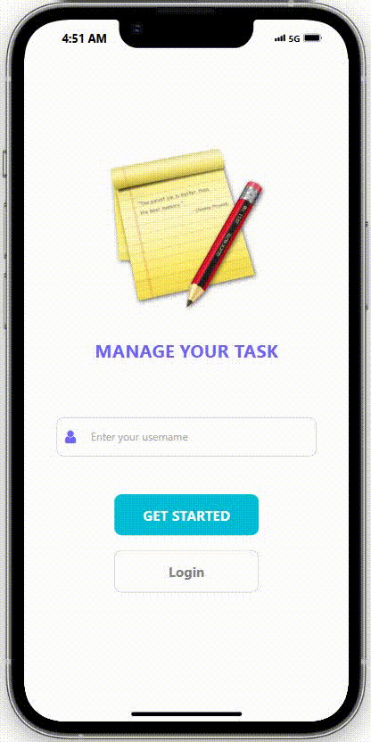
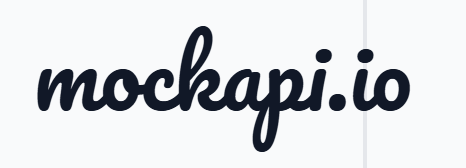
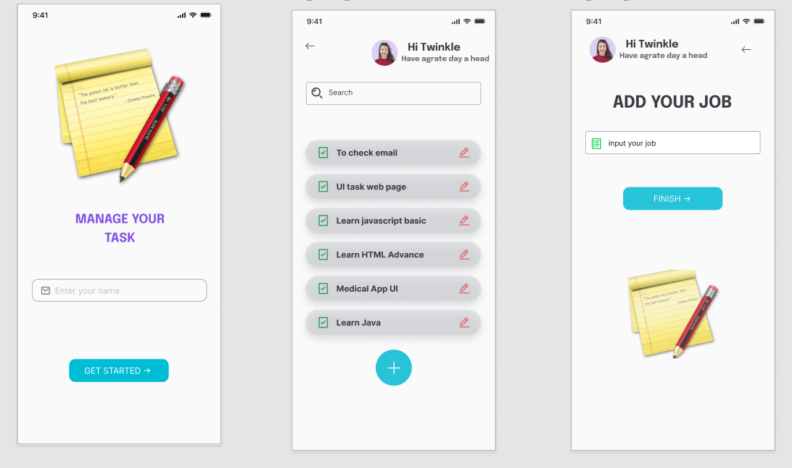

#  <h1> 40 - 21005711 - Mai Quốc Trưởng - APINOTES</h1>

> **Bài tập 7 React Lập Trình Thiết Bị Di Động**
<h4>Sử dụng những cái sau đây:</h4>
<p>
  
  
  
  
  
  
  
  
</p>

---

## 📋 Mục Lục

- [Giới Thiệu](#giới-thiệu)
- [Yêu Cầu](#yêu-cầu)
- [Cài Đặt](#cài-đặt)
- [Sử Dụng MockAPI](#sử-dụng-mockapi)
- [Chạy Ứng Dụng](#chạy-ứng-dụng)
- [Hướng Dẫn Chạy Project Trên VSCode](#hướng-dẫn-chạy-project-trên-vscode)
- [Liên Hệ](#liên-hệ)

---

## 🎉 Giới Thiệu

Dự án **APINOTES** là một ứng dụng quản lý ghi chú trên thiết bị di động được xây dựng bằng **React Native** và **Expo**. Ứng dụng sử dụng **MockAPI** và **Json server** để quản lý dữ liệu và cung cấp giao diện người dùng thân thiện với thiết bị di động.



---

## 📌 Yêu Cầu

Trước khi bắt đầu, hãy đảm bảo rằng bạn đã cài đặt các công cụ sau:

- **Mobile Simulator**: Tải và cài đặt từ [Chrome Web Store](https://chromewebstore.google.com/detail/mobile-simulator-responsi/ckejmhbmlajgoklhgbapkiccekfoccmk).
  
  
  
- **Node.js**: Tải và cài đặt từ [nodejs.org](https://nodejs.org/).

  

- **Git**: Tải và cài đặt từ [git-scm.com](https://git-scm.com/).

  

---

## 🛠️ Cài Đặt

### 1. Tạo Ứng Dụng Expo

```bash
npx create-expo-app YOUR_PROJECT --template blank
cd YOUR_PROJECT
npx expo install react-dom react-native-web @expo/metro-runtime
```

### 2. Cài Đặt Navigation và Icon (FontAwesome)

```bash
npm install @react-navigation/native @react-navigation/stack react-native-gesture-handler react-native-reanimated react-native-screens react-native-safe-area-context @react-native-community/masked-view
npm install @react-navigation/native-stack
```

### 3. Cài Đặt Các Thư Viện Khác

```bash
expo install expo-linear-gradient
npm install react-native-vector-icons
```

### 4. Cài Đặt JSON Server

```bash
npm install -g json-server
json-server --watch db.json --port 5000
```

### 5. Cài Đặt Axios

```bash
npm install axios
```

---

## 🛠️ Sử Dụng MockAPI

1. Truy cập [MockAPI.io](https://mockapi.io/).

   

2. **Bước 1: Đăng nhập và Tạo Dự Án Mới**

   - Đăng nhập vào MockAPI.
   - Nhấn **Create New Project**.
   - Đặt tên cho dự án: `My Notes API`.
   - Nhấn **Create Project**.

3. **Bước 2: Tạo Resource**

   - Nhấn **New Resource**.
   - Thiết lập các giá trị cần thiết cho Resource.

---

## 🚀 Chạy Ứng Dụng

```bash
npx expo start
```

---

## 🖥️ Hướng Dẫn Chạy Project Trên VSCode

1. **Clone Repository**

   ```bash
   git clone <URL_REPOSITORY>
   ```

2. **Mở Thư Mục Trong VSCode**

   - Mở VSCode.
   - Chọn **File > Open Folder** và chọn thư mục vừa clone về.

3. **Cài Đặt Dependencies**

   ```bash
   npm install
   yarn
   ```

4. **Chạy Ứng Dụng**

   ```bash
   npx expo start
   npm run web
   ```

---

## 📧 Liên Hệ

- **Email**: maiqtruong2403@gmail.com or nguyennthanhtung0900@gmail.com
- **GitHub**: [MaiQuocTruong](https://github.com/MaiQuocTruong)

---

## 🎨 Thiết Kế



---

**Cảm ơn bạn đã sử dụng dự án này!**

---


---

### 🌟


---

